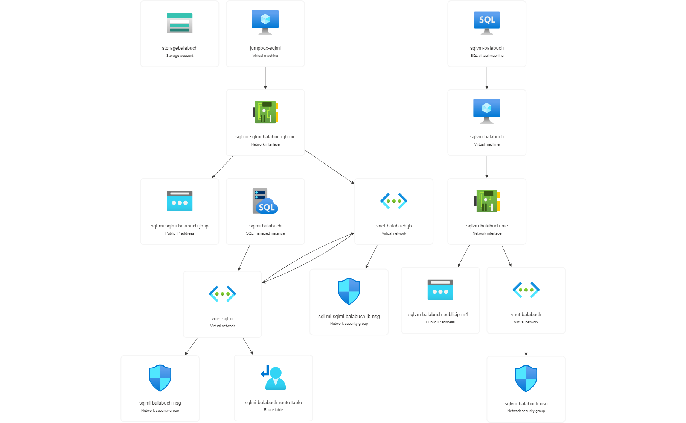

# Deploy the solution

In this section you will provision all Azure resources required to complete labs. We will use a pre-defined ARM template with the definition of all Azure services used to ingest, store, process and visualize data.

The ARM template (template-latest.json) is used to provision the SQL VM migration to Azure SQL Managed Instance PoC.

## Instructions

Right-click or `Ctrl + click` the button below to open the Azure Portal in a new window. This will redirect you to the Custom Deployment wizard in the Azure Portal.

Select the Azure subscription that you would like to use for the lab.
Specify a name for the resource group. The template will deploy 20 Azure resources in a resource group.
Specify the region for the resource group.

## Deployment diagram

## Azure Resources
The template provisions the following resources in the Azure subscription

- Azure Resource Group
- Azure Storage Account
- Azure SQL Managed Instance
- VNet for Azure SQL Managed Instance
- NSG for Azure SQL Managed Instance
- Virtual network traffic routing
- Azure SQL VM
- Network interface for Azure SQL VM
- VNet for Azure SQL VM
- Public IP for Azure SQL VM
- NSG for Azure SQL VM
- JumpBox VM
- Network interface for JumpBox VM
- VNet for JumpBox VM
- NSG for JumpBox VM
- Public IP for JumpBox VM

> [!IMPORTANT]
> Please note that it takes 6 to 8 hours approximately to provision all these resources in an Azure subscription.

Some of the Azure services provisioned require a globally unique name and a “suffix” has been added to their names to ensure uniqueness.

| Azure Service | Name   | Pricing Tier    | How to |
|:----          |:----- | :----   |:----- |
| Resource Group | 1clickPoC |   | [Create a Resource Group](https://learn.microsoft.com/en-us/azure/azure-resource-manager/management/manage-resource-groups-portal#create-resource-groups)
| Storage Account | storage*suffix* |    |[Create a storage account](https://learn.microsoft.com/en-us/azure/storage/common/storage-account-create?tabs=azure-portal)|
| SQL Server on Azure VM| sqlvm-*suffix* | Standard_D8s_v3 |[Provision SQL Server on Azure VM](https://learn.microsoft.com/en-us/azure/azure-sql/virtual-machines/windows/create-sql-vm-portal?view=azuresql) |
| Azure SQL Managed Instance | sqlmi-*suffix*| GP_Gen5 8vCore|[Create an Azure SQL Managed Instance](https://learn.microsoft.com/en-us/azure/azure-sql/managed-instance/instance-create-quickstart?view=azuresql)|

### Credential

|  | Admin User Name   | Password    |
|:----          |:----- | :----   |
| SQL VM | sqladmin | My\$upp3r\$ecret |
| Azure SQL MI | sqladmin | My\$upp3r\$ecret |
| JumpBox VM | sqladmin | My\$upp3r\$ecret |

## Page Navigator

[Index: Table of Contents](../index.md)

[Prev: SQL VM migration to Azure SQL Managed Instance POC](../README.md)

[Next: Assessment](../assessment/README.md)
