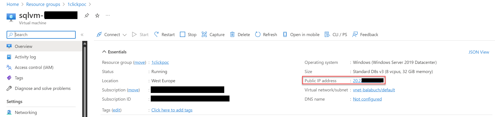

# Start Online Database Migration

Now, it's time to perform a online migration of the Adventureworks2019 database from SQL Server on Azure VM to an Azure SQL Managed Instance by using Microsoft Azure CLI.

1. Run the following to login from your client using your default web browser

    `az login`

    If you have more than one subscription, you can select a particular subscription.

    `az account set --subscription <subscription-id>`

    The [Azure SQL migration extension for Azure Data Studio](https://learn.microsoft.com/en-us/sql/azure-data-studio/extensions/azure-sql-migration-extension?view=sql-server-ver16) enables you to assess, get Azure recommendations and migrate your SQL Server databases to Azure.

    In addition, the Azure CLI command [az datamigration](https://learn.microsoft.com/en-us/cli/azure/datamigration?view=azure-cli-latest) can be used to manage data migration at scale.

    az datamigration sql-service create --resource-group "1clickpoc" --sql-migration-service-name "MySqlMigrationService" --location "westeurope"

2. Backup database

    Backup must be taken before starting the migration:
    - [Create SAS tokens for your storage containers](https://learn.microsoft.com/en-us/azure/cognitive-services/translator/document-translation/create-sas-tokens?tabs=Containers)
    - [Create a SQL Server credential using a shared access signature](https://learn.microsoft.com/en-us/sql/relational-databases/tutorial-use-azure-blob-storage-service-with-sql-server-2016?view=sql-server-ver16#2---create-a-sql-server-credential-using-a-shared-access-signature)
    - [Database backup to URL](https://learn.microsoft.com/en-us/sql/relational-databases/tutorial-use-azure-blob-storage-service-with-sql-server-2016?view=sql-server-ver16#3---database-backup-to-url)

    The following T-SQL is an example that creates the credential to use a Shared Access Signature and creates a backup.

    ```sql
    USE master
    CREATE CREDENTIAL [https://storagemigration.blob.core.windows.net/backup] 
      -- this name must match the container path, start with https and must not contain a forward slash at the end
    WITH IDENTITY='SHARED ACCESS SIGNATURE' 
      -- this is a mandatory string and should not be changed   
     , SECRET = '' 
       -- this is the shared access signature key. Don't forget to remove the first character "?"   
    GO
    
    -- Back up the full AdventureWorks2019 database to the container that you created
    BACKUP DATABASE AdventureWorks2019 TO URL = 'https://storagemigration.blob.core.windows.net/backup/AdventureWorks2019.bak'
    ```

3. Online migration

    Use the **az datamigration sql-managed-instance create** command to create and start a database migration.

az datamigration sql-managed-instance create `
--source-location '{\"AzureBlob\":{\"storageAccountResourceId\":\"/subscriptions/<SubscriptionId>/resourceGroups/<ResourceGroupName>/providers/Microsoft.Storage/storageAccounts/<StorageAccountName>\",\"accountKey\":\"<StorageKey>\",\"blobContainerName\":\"AdventureWorksContainer\"}}' `
--migration-service "/subscriptions/<SubscriptionId>/resourceGroups/<ResourceGroupName>/providers/Microsoft.DataMigration/SqlMigrationServices/MySqlMigrationService" `
--scope "/subscriptions/<SubscriptionId>/resourceGroups/<ResourceGroupName>/providers/Microsoft.Sql/managedInstances/<ManagedInstanceName>" `
--source-database-name "AdventureWorks2019" `
--source-sql-connection authentication="SqlAuthentication" data-source="<AzureSQLVM_IPAddress>" password="My$upp3r$ecret" user-name="sqladmin" `
--target-db-name "AdventureWorks2019" `
--resource-group <ResourceGroupName> `
--managed-instance-name <ManagedInstanceName>

1. In the Azure Portal, find the resource group you just created and navigate to the Azure SQL VM.
2. In the overview page, copy the Public IP Address
    

    > [!CAUTION]
    > Now you have to connect to the Jumpbox VM.
    > Use the credentials provided in the deploy page.

3. Install az datamigration extension. Open either a command shell or PowerShell as administrator.

    `az extension add --name datamigration`

4. Run the following to login from your client using your default web browser

    `az login`

## Run the assessment

1. We can run a SQL server assessment using the ***az datamigration get-assessment*** command.

    > [!IMPORTANT]
    > Change your IP Address

2. Assessment at scale using config file

    We can also create a config file to use as a parameter to run assessment on SQL servers.The config file has the following structure:

    ```json
    {
        "action": "Assess",
        "outputFolder": "C:\\Output",
        "overwrite":  "True",
        "sqlConnectionStrings": [
            "Data Source=Server1.database.net;Initial Catalog=master;Integrated Security=True;",
            "Data Source=Server2.database.net;Initial Catalog=master;Integrated Security=True;"
        ]
    }
    ```

    The config file can be passed to the cmdlet in the following way

    `az datamigration get-assessment --config-file-path "C:\Users\user\document\config.json"`

    > [!TIP]
    > To view the report, go to **C:\Output** folder and check the json file.

    Learn more about using [CLI to assess sql server](https://github.com/Azure-Samples/data-migration-sql/blob/main/CLI/sql-server-assessment.md)

## Performance data collection

This step is optional. We already have a Azure SQL MI provisioned.

1. We can run a SQL server performance data collection using the ***az datamigration performance-data-collection*** command.

    `az datamigration performance-data-collection --connection-string "Data Source=20.229.104.177,1433;Initial Catalog=master;User Id=sqladmin;Password=My$upp3r$ecret" --output-folder "C:\Output" --perf-query-interval 10 --number-of-iteration 5 --static-query-interval 120`

    > [!TIP]
    > Collect as much data as you want, then stop the process.
    > To view the report, go to **C:\Output** folder and check the report file.

2. Running performance data collection at scale using config file

    We can also create a config file to use as a parameter to run performance data collection on SQL servers.
    The config file has the following structure:

    ```json
    {
        "action": "PerfDataCollection",
        "outputFolder": "C:\\Output",
        "perfQueryIntervalInSec": 20,
        "staticQueryIntervalInSec": 120,
        "numberOfIterations": 7,
        "sqlConnectionStrings": [
            "Data Source=Server1.database.net;Initial Catalog=master;Integrated Security=True;",
            "Data Source=Server2.database.net;Initial Catalog=master;Integrated Security=True;"
        ]
    }
    ```

    The config file can be passed to the cmdlet in the following way.

    `az datamigration performance-data-collection --config-file-path "C:\Users\user\document\config.json"`

    > [!TIP]
    > You can look into the output folder to find a CSV file which also gives the details of performance data collected.

    Learn more about using [CLI to perform data collection](https://github.com/Azure-Samples/data-migration-sql/blob/main/CLI/sql-server-sku-recommendation.md#performance-data-collection-using-connection-string)

## SKU Recommendation

1. We can get SKU recommendation using the **az datamigration get-sku-recommendation** command.

    `az datamigration get-sku-recommendation --output-folder "C:\Output" --display-result --overwrite`

2. Getting SKU recommendation at scale using config file.

    We can also create a config file to use as a parameter to get SKU recommendation on SQL servers.The config file has the following structure:

    ```json
    {
        "action": "GetSKURecommendation",
        "outputFolder": "C:\\Output",
        "overwrite":  "True",
        "displayResult": "True",
        "targetPlatform": "any",
        "scalingFactor": 1000
    }
    ```

    > [!TIP]
    > You can look into the output folder to find a HTML file which also gives the details of SKU being recommended.

    Learn more about using [CLI to get SKU recommendation](https://github.com/Azure-Samples/data-migration-sql/blob/main/CLI/sql-server-sku-recommendation.md#performance-data-collection-using-connection-string)
